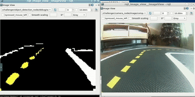

# DuckieTown adaptation of An efficient solution for semantic segmentation: ShuffleNet V2 with atrous separable convolutions
This repository is a fork of the https://github.com/sercant/mobile-segmentation repository. They presented a computationally efficient approach to semantic segmentation, while achieving a high mean intersection over union (mIOU), 70.33% on Cityscapes challenge. The network proposed is capable of running real-time on mobile devices.

This models performs pretty well in the Duckietown Simulator too! 75.60% on the Duckietown Segmentation Dataset.
## Video of the actual duckie making loops.


## Monitoring the segmentation model using ROS
This is the same loop, but another time in the day. Performance is consistant across different illumination scenerio and robust to backgrounds and outperforms any traditionnal "OpenCV" approach, while staying light weight.

The model was first pre-trained on cityscapes, then trained with 50000 samples of simulation data, and then fine-tuned with a small real dataset of 200 samples. 



## Getting ready

1. Download or generate a "raw" DuckieTown dataset. [Refer to the Duckietown Dataset Generator](dataset_generator/README.md)
2. Convert the dataset to a MS COCO Compatible format that can be used by most segmentation models. [Refer to the Conversion Jupyter Notebooks](notebooks/README.md)
3. Prepare COCO Compatible dataset for training. Example scripts and code is available under the `dataset` folder. The dataset should be in `tfrecord` format.

## Model zoo

Please refer to the original repository for pre-trained models.


## Training

To learn more about the available flags you can check `common.py` and the specific script that you are trying to run (e.g. `train.py`).

2-3 epochs of fine-tuning should be enough, more would likely cause overfitting. The model is already pre-trained on Cityscapes, so the final training is basically domain adaptation. 

The "output_stride" parameter can be used to allow this network to work on smaller resolution images. The Network was originally designed to work with 640x480 images, with an output stride of 16. For smaller images, such as the ones we use in Duckietown, the bottleneck is to narrow. Reducing the output stride to 8 for 320x240 and 4 for 160x120 reduce this bottleneck. The only drawback is that those network take as much time as the 640x480 image on lower resolution image. 

Long story short: Next time, we should generate 640x480 datasets, because lowering the resolution will not help!


### Example training configuration

Training on DuckieTown:

```
python train.py \
    --model_variant=shufflenet_v2 \
    --tf_initial_checkpoint=./checkpoints/model.ckpt \
    --training_number_of_steps=12000 \
    --base_learning_rate=0.001 \
    --fine_tune_batch_norm=True \
    --initialize_last_layer=False \
    --output_stride=4 \
    --train_crop_size=120 \
    --train_crop_size=160 \
    --train_batch_size=16 \
    --dataset=duckietown \
    --train_split=train \
    --dataset_dir=./dataset/duckietown2/merged_with_real/tfrecords \
    --save_summaries_images \
    --train_logdir=./logs \
    --loss_function=sce
```

Train for Duckietown Bezier
python train.py \
    --model_variant=shufflenet_v2 \
    --tf_initial_checkpoint=./checkpoints/model.ckpt \
    --training_number_of_steps=120000 \
    --base_learning_rate=0.001 \
    --fine_tune_batch_norm=True \
    --initialize_last_layer=False \
    --output_stride=8 \
    --train_crop_size=240 \
    --train_crop_size=320 \
    --train_batch_size=16 \
    --dataset=duckietown \
    --train_split=train \
    --dataset_dir=./dataset/duckietown/bezier/tfrecords \
    --save_summaries_images \
    --train_logdir=./logs \
    --loss_function=sce
```

```sh
python train.py \
    --model_variant=shufflenet_v2 \
    --tf_initial_checkpoint=./checkpoints/model.ckpt \
    --training_number_of_steps=120000 \
    --base_learning_rate=0.001 \
    --fine_tune_batch_norm=True \
    --initialize_last_layer=False \
    --output_stride=16 \
    --train_crop_size=769 \
    --train_crop_size=769 \
    --train_batch_size=16 \
    --dataset=cityscapes \
    --train_split=train \
    --dataset_dir=./dataset/cityscapes/tfrecord \
    --train_logdir=./logs \
    --loss_function=sce
```
Training with 8gb commodity GPU:
```
python train.py     --model_variant=shufflenet_v2     --tf_initial_checkpoint=./checkpoints/model.ckpt     --training_number_of_steps=120000     --base_learning_rate=0.001     --fine_tune_batch_norm=True     --initialize_last_layer=False     --output_stride=16     --train_crop_size=769     --train_crop_size=769     --train_batch_size=3     --dataset=cityscapes     --train_split=train     --dataset_dir=./dataset/cityscapes/tfrecord     --train_logdir=./logs     --loss_function=sce
```

**Important:** To use DPC architecture in your model, you should also set this parameter:

    --dense_prediction_cell_json=./core/dense_prediction_cell_branch5_top1_cityscapes.json

### Example evaluation configuration

Duckietown "merged_with_real":
```sh
python evaluate.py \
    --model_variant=shufflenet_v2 \
    --eval_crop_size=120 \
    --eval_crop_size=160 \
    --output_stride=4 \
    --eval_logdir=./logs/eval \
    --checkpoint_dir=./logs \
    --dataset=duckietown \
    --dataset_dir=./dataset/duckietown2/merged_with_real/tfrecords
```
Duckietown "bezier":
```sh
python evaluate.py \
    --model_variant=shufflenet_v2 \
    --eval_crop_size=240 \
    --eval_crop_size=320 \
    --output_stride=8 \
    --eval_logdir=./logs/eval \
    --checkpoint_dir=./logs \
    --dataset=duckietown \
    --dataset_dir=./dataset/duckietown2/bezier/tfrecords
```


Cityscapes:
```sh
python evaluate.py \
    --model_variant=shufflenet_v2 \
    --eval_crop_size=1025 \
    --eval_crop_size=2049 \
    --output_stride=4 \
    --eval_logdir=./logs/eval \
    --checkpoint_dir=./logs \
    --dataset=cityscapes \
    --dataset_dir=./dataset/cityscapes/tfrecord
```
## Visualize

### DuckieTown
In order to visualize segmentation for the Duckietown dataset:
```
python visualize.py --checkpoint_dir logs \
     --vis_logdir logs \
      --dataset_dir dataset/duckietown2/merged_with_real/tfrecords/ \
      --output_stride 4 \
      --dataset duckietown
```

### Cityscapes
In order to visualize segmentation for the Cityscapes dataset:
```
python visualize.py --checkpoint_dir checkpoints --vis_logdir logs --dataset_dir dataset/cityscapes/tfrecord/
```

**Important:** If you are trying to evaluate a checkpoint that uses DPC architecture, you should also set this parameter:  

    --dense_prediction_cell_json=./core/dense_prediction_cell_branch5_top1_cityscapes.json

## Running on Duckietown:
A pure pursuit controller will take as an input the output of the points generated by the segementation mask. 

See the [solution folder](solution)
